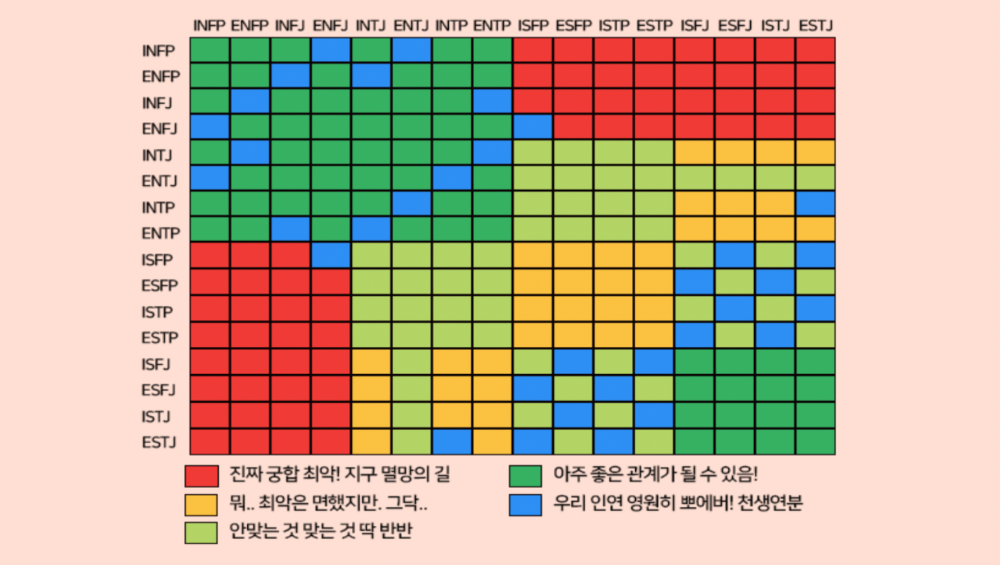

# MBTI Matching

# 최종보고서

[MBTI 기반 이상형 매칭 애플리케이션]

과목명: 분산시스템

팀 원 : 

유학현 (201713066)
김세영 (201713049)
박용준 (201711147)
서동재 (201713060)
윤영기 (201713025)

제 출 일 : 2021.06.11

# 목차

1. 팀 구성 및 역할
2. 프로젝트 목표
    
    2.1 프로젝트 개요
    2.2 목표 기능
    2.3 개발 환경
    
3. 시스템 설계
    
    3.1 CMWinClient
    3.2 CMWinClientEventHandler
    3.3 CMWinServerEventHandler
    
4. 어플리케이션 사용 방법
5. 영상과 Github 링크

1. 팀 구성 및 역할

유학현 : 프로젝트 관리 및 개발 지원
김세영 : CM 기반 이벤트 설계 및 개발
박용준 : 기본 프로그램, 서버 설계 및 개발
서동재 : 개발 및 기타 업무 지원
윤영기 : 기본 프로그램 설계 및 데이터베이스 개발

2. 프로젝트 목표

2.1 프로젝트 개요

2019 년 하반기를 기점으로 전세계적으로 퍼져나간 코로나 19 바이러스의 대유행은 우리의 일상생활에 큰 변화를 가져왔다. 코로나 예방 수칙 중 하나인 ‘사회적 거리두기’의 장기화로 인해 언택트 (Untact)의 시대를 맞이하게 됨으로써 사람들은 기존 오프라인으로 이루어지던 모임들을 재택근무, 온라인 수업 그리고 화상회의 같은 온라인상의 모임으로 대체하게 되었다. 이러한 형태의 모임 증가는 이를 지원하기 위한 애플리케이션에 대한 수요 증가로 나타났으며 이는 곧 ZOOM, MS Teams 와 같은 온라인 회의 지원 애플리케이션의 사용률 증가로 이어졌다. 이렇듯 학업, 업무 등의 다양한 오프라인 활동들을 온라인으로 대체하고자 하는 변화는 이성과의 만남 방식 또한 바꾸어 놓았다. 기존의 오프라인 소개팅을 온라인으로 대체하기 시작한 것이다. 이는 곧, Tinder, Bumble 과 같은 온라인 데이팅 어플리케이션의 수요 증가로 이어지게 되었다. 따라서 우리는 이러한 수요 증가를 기반으로 기존 데이팅 애플리케이션과 차별화된 특성을 갖는 데이팅 애플리케이션의 개발을 목표로 하였다.

2.2 목표 기능



[그림 1] MBTI 성격 유형별 궁합 차트

최근 젊은 층 사이에서 화제가 되고 있는 성격 유형 검사 마이어스-브릭스 유형 지표(Myers-Briggs Type Indicator), 약칭 MBTI 를 활용한 이상형 매칭 및 데이팅 애플리케이션으로 다음과 같은 서비스를 제공한다.

- ID와PW를 사용하여 사용자 계정 생성 및 로그인한다.
- 사용자의 기본 정보 (키, 체중,MBTI와 취미 등) 와 사용자가 원하는
이성의 조건 정보를 입력 받아 데이터베이스에 저장한다.
- 새로운 사용자가 추가되면 다른 사용자들이 이를 확인할 수 있다.
- 데이터베이스에 저장된 사용자 입력 정보를 서버의 이상형 추천 로직에
대입하여 사용자 사이의 상호 평가 점수를 산출한 뒤, 이를 기반으로
이상형을 매칭하여 사용자에게 나타낸다.
- 사용자 간의 매칭이 성사되면 CM 을 기반으로 1:1 대화가 가능하도록
한다.

2.3 개발 환경

- 개발언어:JAVA
- 사용 IDE : Eclipse IDE for Java Developers (includes Incubating
components)
- 사용 프레임워크 : CM

 3. 시스템 설계

Communication Framework (CM)를 기반으로, 기존 메소드를 수정하는 형식으로 설계를 진행하였다. 클라이언트 – 서버 형태로, 데이터 관련 프로세싱을 최대한 서버에서 처리할 수 있도록 설계하였다. 기존 CM 과 연동된 MySQL을 사용하여 데이터베이스를 설계하는 방향으로 구상하였으나, 차후 구현 단계에서 이를 사용하는 대신 유저 데이터를 자바 프로젝트 경로에 직접 읽고 쓰는 형식으로 변경되었다.

3.1 CMWinClient

유저가 사용하게 될 클라이언트 프로그램을 구현한 소스 파일. 유저에게 데이터를 입력 받는 창을 띄우거나 서버로부터 받은 데이터를 출력해주는 메소드들로 구성되어 있다. 또한 유저간 채팅 기능을 지원하기 위해 유저 데이터 파일을 읽는 메소드를 포함하고 있다. 해당 데이터 파일 경로 설정을 코드 내에서 지정해줘야 하는데, CMWinClient 664, 689줄에서 경로 설정을 할 수 있다.

```java
m_outTextPane2 = new JTextPane();
```

- 채팅창 전용으로 사용할 JTextPane 추가. 클라이언트 어플리케이션의 오른쪽 절반에 해당한다. 채팅 시 사용자가 발신한 메시지와 수신한 메시지를 printMessage2() 메소드를 통해 출력하며 발신 주체가 누구인지 아이디로 표시한다.

```java
m_matchButton = new JButton("Start Match");
```

- 매칭 버튼 추가. 해당 버튼을 누르면 tryMatch() 메소드가 실행된다.

```java
public void loginExample();
```

- 사용자가 로그인 시 사용하는 메소드. 클라이언트 어플리케이션이 실행되면 자동으로 실행되며 사용자는 이 메소드로 서버에 로그인 요청을 보낸다. 내부적으로는 CMClientStub 에서 기본 제공하는 메소드인 loginCM()을 이용한다.

```java
JMenu list = new Jmenu("Partner");
JMenuItem list1 = new JMenuItem("Start Match");
JMenuItem list2 = new JMenuItem("Matched Partner");
JMenuItem list3 = new JmenuItem("Choose Partner");
```

- 클라이언트 창에 파트너 관련 메뉴를 생성한다.

```java
public void printMessage2(String strText);
```

- 채팅창에 출력하는 용도로 사용하는 메소드. 기존 테스트 어플리케이션에 있는 printMessage() 메소드를 살짝 변형한다.

```java
public void example3();
```

- 회원가입 시 사용하는 메소드. loginExample()로 서버에 로그인을 요청한 클라이언트가 서버로부터 UserEvent를 이용한 응답을 받을 때 이벤트 아이디가 "requireRegister"이면 이벤트 아이디가 NEW_USER인 DataEvent를 받은 후 실행한다.

```java
String name = null;
String password = null;
String gender = null;
String age = null;
String height = null;
String weight = null;
String mbti = null;
String hobby = null;
String p_age = null;
String p_height = null;
String p_weight = null;
```

- 아이디와 패스워드를 비롯해 성별, 나이, 키 등의 정보를 사용자로부터 입력받는다. 아이디의 경우 ‘b’, ‘g’, ‘s’를 입력할 경우 적합하지 않은 아이디로 판단하고 다시 입력할 것을 요청하는 메시지를 띄운다. (본 어플리케이션은 채팅에서 chat() 메소드를 활용하는데 chat메소드는 아이디 영역에서 b는 broadcast, g는 group, s는 session으로 받아들이기 때문에 해당 아이디를 생성하지 못하게 조치했다.)
    
    이벤트 아이디가 "register"인 UserEvent를 생성한 후 CMClientStub에서 기본 제공하는 메소드인 send()를 이용해 디폴트 서버에 이벤트를 전달한다. 서버는 사용자가 보낸 정보를 갖고 기존 사용자 풀과 대조해 중복된 아이디일 경우 이를 반려하는데 이때 example3() 메소드가 다시 호출된다.
    

```java
public void testLogoutDS();
```

- 로그아웃할 때 사용하는 메소드. 로그아웃 부분은 따로 추가할 기능이 없었기 때문에 기
존 테스트 어플리케이션에 있는 testlogoutDS() 메소드를 그대로 활용했다.

```java
public void testStartCM();
```

- CM 시작 시 사용하는 메소드. 시작 부분은 따로 추가할 기능이 없었기 때문에 기존 테
스트 어플리케이션에 있는 testStartCM() 메소드를 그대로 활용했다.

```java
public void testTerminateCM();
```

- CM 종료 시 사용하는 메소드. 종료 부분은 따로 추가할 기능이 없었기 때문에 기존 테
스트 어플리케이션에 있는 testTerminateCM() 메소드를 그대로 활용했다.

```java
public class MyActionListener implements ActionsListner();
```

- 기존의 ActionListner를 수정해서 받은 액션이 m_inTextField로부터 온 것이면 채팅 부분에 활용할 수 있게 했다. 기존 테스트 어플리케이션에서 메뉴 번호를 입력받던 intextField를 수정하여 채팅 입력에 사용할 수 있도록 용도를 변경했고 사용자는 “아이디/메시지”의 형태로 입력했다. 입력받은 메시지는 ‘/’를 구분자로 활용해 앞부분을 수신자 아이디, 뒷부분을 수신 메시지로 구분했다. CMClientStub에서 기본 제공하는 메소드인 chat()을 이용하여 원하는 사용자에게 채팅을 보낼 수 있다. 이때, 사용자가 입력한 아이디가 사용자와 매칭된 사용자인지 확인하는 작업이 이루어지며 매칭된 사용자가 아닐 경우 채팅이 거부된다. 기존의 MyMenuListener를 수정해서 어플리케이션에 필요한 메뉴를 등록했다.

```java
public class MyMenuListener implements ActionListener();
```

- 기존의 MyMenuListener를 수정해서 어플리케이션에 필요한 메뉴를 등록한다.

```java
public void Start Match();
```

- 서버에게 이성 리스트 요구하는 메소드. 더미 데이터 보내는 메소드로 “1”값을 보낸다.

```java
public void Matched_Partner();
```

- 서버에게 현 사용자가 매칭된 유저 리스를 요구하는 메소드. 더미 데이터로 “2”를 보낸다.

```java
public void Choose_Partner();
```

- 서버에게 본인이 선택한 유저 이름을 보내는 메소드. 더미 데이터로 “유저이름” (String)을 보낸다.

3.2 CMWinClientEventHandler

```java
private void processDataEvent(CMEvent cme);
```

- 기존 processDataEvent 메소드를 수정한 메소드. 서버로부터 유저의 입장/퇴장 정보를 받을 수 있다. 유저 데이터가 존재하지 않는 유저인 경우 example3() (회원가입 메소드)를 실행한다. 이하의 절차에 따라 진행된다.

```java
case CMDataEvent.NEW_USER:
```

- 새로운 사용자가 서버에 접속했을 경우의 이벤트 아이디로서, printStyledMessage() 메소드를 사용하여 해당 사용자가 새롭게 접속했음을 해당 클라이언트의 사용자에게 출력하여 알려준다.

```java
case CMDataEvent.REMOVE USER:
```

- 다른 사용자가 서버와 연결을 끊었을 경우의 이벤트 아이디로서, printStyledMessage() 메소드를 사용하여 해당 사용자가 접속 종료했음을 해당 클라이언트의 사용자에게 출력하여 알려준다.

```java
private void processDummyEvent(CMEvent cme)
```

- 기존 processDummyEvent 메소드를 수정한 메소드. 서버로부터 오는 메시지 (유저 정보 리스트, 매칭 리스트 등)의 정보를 출력한다.

```java
private void processDummyEvent(CMEvent cme)
```

- 기존 processUserEvent 메소드를 수정한 메소드. 이하의 절차에 따라 진행된다.

```java
if(ue.getStringID().equals("requireRegister"))
```

- 서버로부터 회원가입을 요구 받을 경우의 이벤트 아이디로서, 회원가입을 할 수 있도록 example3() 메소드가 호출된다.

```java
else if (ue.getStringID().equals("registrationFail"))
```

- 회원가입에 실패했을 경우의 이벤트 아이디로서, 입력한 정보 중 희망 아이디가 서버가 보유한 아이디 리스트에 중복되었을 경우 이러한 이벤트를 받는다. 회원가입에 실패했음을 알리는 메시지를 띄운 뒤, example3() 메소드를 호출하여 사용자는 회원가입을 다시 진행할 수 있다.

3.3 CMWinServerEventHandler

클라이언트로부터 받은 유저가 처음 회원가입할 때 유저의 개인 정보와 이상형 정보, 선택한 사람 등의 정보를 텍스트 문서로 프로젝트 파일 내에 저장하는 메소드들로 구성되어 있다. 유저 개인 정보와 이상형 정보는 user.txt 문서에, 선택한 사람 리스트는 유저 _partner.txt 문서에 기록되고 이 문서들을 통합하는 User_data 폴더가 존재한다. 해당 데이터 파일 경로 설정을 코드 내에서 지정해줘야 하는데, CMWinServerEventHandler 63, 223, 300, 312, 348, 414, 466줄에서 경로 설정을 할 수 있다.

```java
private void processSessionEvent(CMEvent cme)
```

- 기존 processSessionEvent 메소드를 수정한 메소드. 이하의 절차에 따라 진행된다.

```java
case CMSessionEvent.LOGIN:
```

- 서버가 클라이언트로부터 loginExample() 메소드를 이용한 로그인 요청을 받은 경우의
이벤트 아이디로서, 로그인 요청한 아이디가 user.txt에 등록된 사용자인지 확인하고 만약
가입한 사용자가 아니라면 UserEvent의 아이디를 "requireRegister"로 설정하고
CMServerStub에서 기본 제공하는 메소드인 send()을 이용해 클라이언트에게 회신한다.

```java
public void sendCMDummyEvent(String msg, String sender, String session, String group);
```

- 기존 sendCMDummyEvent 메소드를 수정한 메소드. 서버창에는 어떤 유저에게 데이터가
전송되었는지 표시하고 해당 유저에게 데이터(유저 정보 리스트, 매칭 리스트 등)의
정보를 전송한다.

```java
private void processDummyEvent(CMEvent cme);
```

- 기본 processDummyEvent 메소드를 수정한 메소드.
    
    클라이언트로부터 DummyEvent 값으로 “1” (유저 정보 리스트 제공 요청)을 받으면 user.txt (전체유저 정보 파일)에서 해당 유저의 정보(MBTI, 취미, 원하는 이성의 나이, 몸무게, 키)를 읽은 뒤, 다른 이성 유저들의 정보와 비교하여 매칭 점수 (%로 표현)를 Score() 메소드를 통해 계산한다. 그렇게 출력된 정보를 유저(클라이언트)에게 DummyEvent 형식으로 보낸다.
    클라이언트로부터 DummyEvent 값으로 “2” (매칭된 유저 리스트 제공 요청)를 받으면 해당 유저의 유저이름_Partner.txt 파일 (해당 유저가 선택한 유저들 저장된 파일)을 읽은 뒤, 선택한유저이름_Partner.txt 파일을 읽어 상대방도 해당 유저를 선택하였는지 확인한다. 이렇게 확인해서 매칭된 유저 이름을 해당 유저 (클라이언트)에게 DummyEvent 형식으로 보낸다.
    클라이언트로부터 DummyEvent 값으로 “선택한 유저 이름”을 받으면, 해당유저이름_partner.txt 파일에 선택한 유저 이름을 입력하는 메소드이다.
    

```java
private void processUserEvent(CMEvent cme);
```

- 기존 processUserEvent 메소드를 수정한 메소드. 이하의 절차에 따라 진행된다.

```java
else if (ue.getStringID().equals("register"))
```

- 클라이언트의 example3() 메소드를 이용한 회원가입 요청을 받은 경우의 이벤트 아이디 로서, 서버는 받은 이벤트를 분석해 사용자가 가입을 희망하는 "이름"이 user.txt에 이미 등록된 아이디인지 확인한다. 만약 중복된 아이디라면 UserEvent의 아이디를 "registrationFail"로 설정하고 CMServerStub에서 기본 제공하는 메소드인 send()을 이용하여 클라이언트에게 회신한다. 중복된 아이디가 아니라면 UserEvent의 아이디를 "registrationSuccess"로 설정하고 회신한다.

4. 어플리케이션 사용 방법

1. 서버에 접속한 후 클라이언트를 키면 로그인 창이 뜬다. 여기에 아이디와 비번을 입력했을 때 등록된 아이디일 경우 로그인 되고, 다른 유저들한테 로그인 사실이 뜬다. 등록된 아이디가 아닐 경우 회원가입 안내 메시지가 뜨고 회원가입 창이 열린다. 본인의 아이디, 비번, 개인정보를 입력 후 ok 버튼을 누르면 일련의 정보가 user.txt 문서에 저장된다. 만약 아이디가 중복됐을 경우 중복된 아이디 메시지가 라는 뜨면서 회원가입이 안 된다.
2. Start Match 버튼을 누르면 등록된 이성 리스트가 뜬다. (남성 유저일 경우 여성 리스트가, 여성 유저일 경우 남성 리스트가 뜬다) 표시되는 정보는 이름, 나이, 키, 체중, MBTI, 취미가 있으며 이름을 제외한 나머지 요소들이 이상형과 얼마나 매치되는가에 따라서 궁합도가 측정된다.
3. Choose Partner 버튼을 누르면 창이 하나 뜨는데, 여기서 본인이 원하는 사람의 아이디를 입력하면 본인_partner.txt 문서에 그 사람이 기록된다.
4. Matched Partner 버튼을 누르면 3번 과정에서 두 사람이 서로를 고른 경우에 한해서 Matched Partner 리스트에 서로의 아이디가 뜬다.
5. 서로간에대화를하고싶을경우밑의입력란에‘아이디/하고싶은말’을치면대화내용이 서로에게 보인다.

5. 영상, Github 링크

- 실행영상 :
    
    [분산시스템 10팀 어플 실행 영상.mp4](img_ref/%E1%84%87%E1%85%AE%E1%86%AB%E1%84%89%E1%85%A1%E1%86%AB%E1%84%89%E1%85%B5%E1%84%89%E1%85%B3%E1%84%90%E1%85%A6%E1%86%B7_10%E1%84%90%E1%85%B5%E1%86%B7_%E1%84%8B%E1%85%A5%E1%84%91%E1%85%B3%E1%86%AF_%E1%84%89%E1%85%B5%E1%86%AF%E1%84%92%E1%85%A2%E1%86%BC_%E1%84%8B%E1%85%A7%E1%86%BC%E1%84%89%E1%85%A1%E1%86%BC.mp4)
    
- Github URL : [https://github.com/071yoon/MBTI_Matching.git](https://github.com/071yoon/MBTI_Matching.git)
